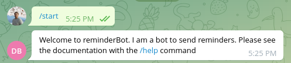
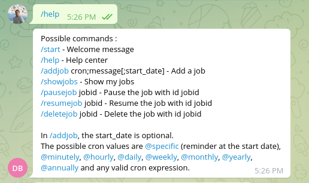
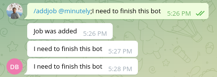
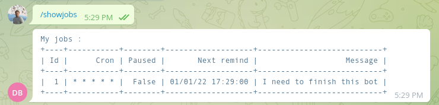
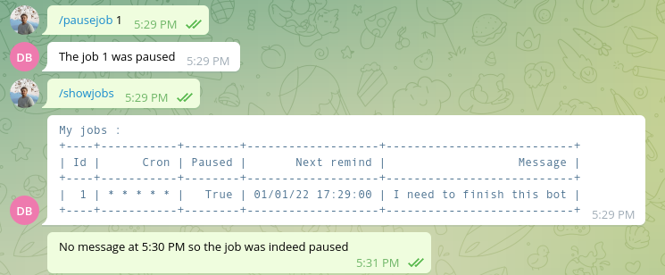
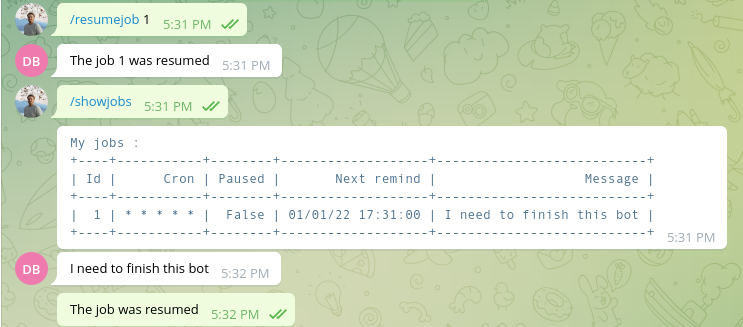
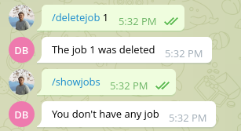

Usage
=====
This page will show examples of interaction with a telegram_reminder_bot.

This assumes that the bot has been set up and the user is in the allowed users in the configuration,

Start command
-------------

The ``/start`` command does not take any argument. The displayed message depends on if the user is auhorized or not.

Help command
------------

The ``/help`` command does not take any argument. The displayed message depends on if the user is auhorized or not.

Add job and normal behavior
---------------------------

The ``/addjob`` commands take up to three arguments :

* the cron expression or ``@specific``.
* the message
* an optional start date

in the format : ``/addjob cron;message[;start_date]``.

The cron expression
^^^^^^^^^^^^^^^^^^^

This can be any valid cron expression (like ``*/5 * * * *``) or shortcuts :

+---------------+---------------+
| Shortcut      | Cron value    |
+===============+===============+
| ``@minutely`` | ``* * * * *`` |
+---------------+---------------+
| ``@hourly``   | ``0 * * * *`` |
+---------------+---------------+
| ``@midnight`` | ``0 0 * * *`` |
+---------------+---------------+
| ``@daily``    | ``0 0 * * *`` |
+---------------+---------------+
| ``@weekly``   | ``0 0 * * 0`` |
+---------------+---------------+
| ``@monthly``  | ``0 0 1 * *`` |
+---------------+---------------+
| ``@yearly``   | ``0 0 1 1 *`` |
+---------------+---------------+
| ``@annually`` | ``0 0 1 1 *`` |
+---------------+---------------+

The ``@specific`` keyword does not represent a cron expression, but a single reminder that will happen at the start date.

.. note::
    When using ``@specific``, be sure to set the start date, otherwise, you will have a speficic remind in the minute following the creation and that's it.

.. note::
    A job with ``@specific`` will be deleted after the message is sent, as it is the only message to send.

The message
^^^^^^^^^^^

The message can be composed of any character that is not a semi-colon (``;``).

The start date
^^^^^^^^^^^^^^

The start date is optional.

The start date must be given in the format ``%d/%m/%y %H:%M:%S``.

If no start date is given, then the default is now.

.. warning::

    If you don't give a start date, don't pull the final semi-colon (``;``). For instance, ``/addjob @minutely;message;`` would fail to parse.

Show jobs
---------

The ``/showjobs`` command will display an array with all the jobs associated to the user making the request.

Please note that will the value of "next remind" will indicate that the reminder should happen at 00 seconds, there is no reliable way to tell when the reminder will actually happen (it will happen between :00 and :59 seconds).

Pause job
---------

The ``/pausejob`` command takes ``jobid`` as parameter : ``/pausejob jobid``. The command will only work if 

* ``jobid`` is an int,
* that is the id of a :class:`~telegram_reminder_bot.models.Reminder`,
* and the user associated to the reminder is the user sending the message.

No message will be sent for this job until it is resumed.

.. note::

    The command will work on a reminder that is paused, but will have no effect.

Resume job
----------

The ``/resumejob`` command takes ``jobid`` as parameter : ``/resumejob jobid``. The command will only work if 

* ``jobid`` is an int,
* that is the id of a :class:`~telegram_reminder_bot.models.Reminder`,
* and the user associated to the reminder is the user sending the message.

.. note::

    The command will work on a reminder that is not paused, but will have no effect.

Delete a job
------------

The ``/deletejob`` command takes ``jobid`` as parameter : ``/deletejob jobid``. The command will only work if 

* ``jobid`` is an int,
* that is the id of a :class:`~telegram_reminder_bot.models.Reminder`,
* and the user associated to the reminder is the user sending the message.

.. warning::
    
    There is no way of reverting a ``deletejob`` command.